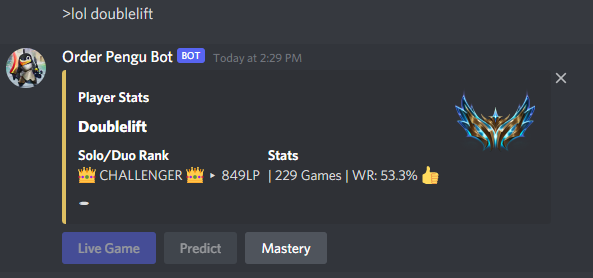
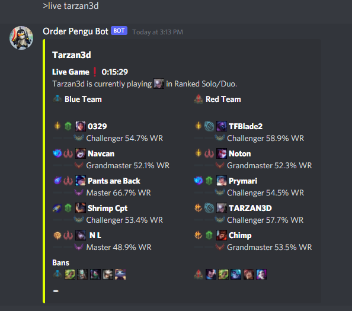
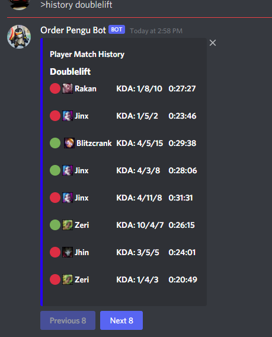
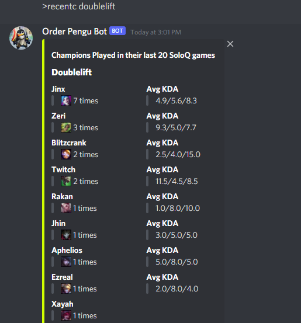
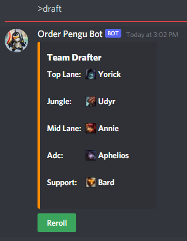
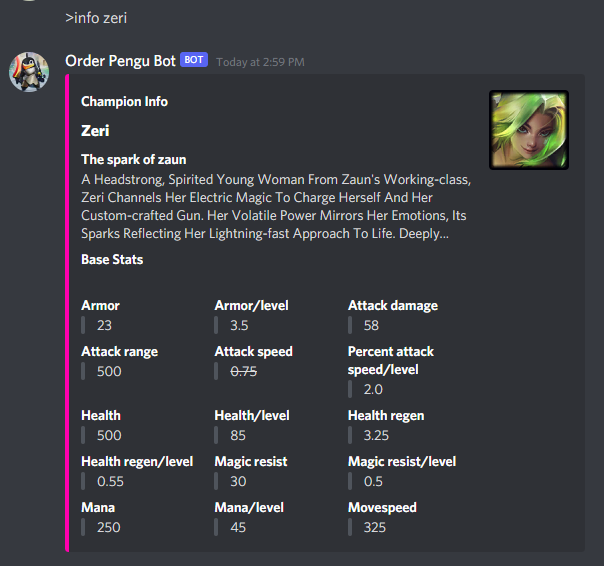
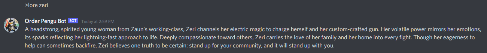

## Order Pengu Bot :penguin:
 A League of Legends discord bot that goes beyond simple statistics. 

## Features :scroll:

### Feature List :bookmark_tabs:

**lol**: View a player's ranked stats.

**live**: View stats about a player's live game.

**history**: View a players ranked match history.

**recentc**: View the most recently played champions for a player.

**team**: View stats about the players in a champ select lobby.

**draft**: Draft a team (1 champion per role).

**rr**: 'Reroll' a champion.

**m**: View a player's champion masteries.

**info**: View a champion's base stats.

**lore**: View a champion's lore.

**leagueify**: Recieve a mosiac created from league of legends champions and icons.
 

&nbsp;&nbsp;&nbsp;&nbsp;&nbsp;&nbsp;&nbsp;&nbsp;&nbsp;&nbsp;&nbsp;&nbsp;&nbsp;&nbsp;&nbsp;&nbsp;&nbsp;&nbsp;&nbsp;&nbsp;&nbsp;&nbsp;&nbsp;&nbsp;&nbsp;&nbsp;&nbsp;&nbsp;&nbsp;&nbsp;&nbsp;&nbsp;&nbsp;&nbsp;&nbsp;&nbsp;&nbsp;&nbsp;&nbsp;&nbsp;&nbsp;&nbsp;&nbsp;&nbsp;&nbsp;&nbsp;&nbsp;&nbsp;&nbsp;&nbsp;&nbsp;**And many more to come...**
### Usage :video_game:
**lol** 
&nbsp;&nbsp;&nbsp;&nbsp;&nbsp; 

**live** 
&nbsp;&nbsp;&nbsp;&nbsp;&nbsp; 

**history** 
&nbsp;&nbsp;&nbsp;&nbsp;&nbsp;&nbsp; 

**recentc** 
&nbsp;&nbsp;&nbsp;&nbsp;&nbsp;&nbsp; 

**team** 
&nbsp;&nbsp;&nbsp;&nbsp;&nbsp;&nbsp; 

**draft** 
&nbsp;&nbsp;&nbsp;&nbsp;&nbsp;&nbsp; 

**rr** 
&nbsp;&nbsp;&nbsp;&nbsp; 

**info** 
&nbsp;&nbsp;&nbsp;&nbsp;&nbsp;&nbsp; 

**lore** 
&nbsp;&nbsp;&nbsp;&nbsp;&nbsp;&nbsp; 

**leagueify** 
&nbsp;&nbsp;&nbsp;&nbsp;&nbsp;&nbsp; 
## Contact
[Ravnit Lotay](https://github.com/Ravnit202)

