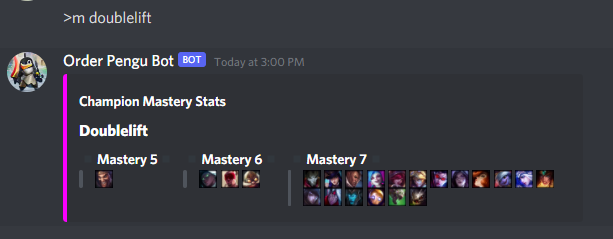

## Overview :crystal_ball:
A League of Legends discord bot that goes beyond simple statistics.
## Features :bookmark_tabs:

### Feature List

**lol**: View a player's ranked stats.

**live**: View stats about a player's live game.

**history**: View a players ranked match history.

**recentc**: View the most recently played champions for a player.

**team**: View stats about the players in a champ select lobby.

**draft**: Draft a team (1 champion per role).

**rr**: 'Reroll' a champion.

**m**: View a player's champion masteries.

**info**: View a champion's base stats.

**lore**: View a champion's lore.

**leagueify**: Recieve a mosiac created from league of legends champions and icons.

***And many more to come...***
### Usage
**lol**: 

**live**: 

**history**: 

**recentc**: 

**team**: 

**draft**: 

**rr**: 

**info**: 

**lore**: 

**leagueify**: 
## Contact
[Ravnit Lotay](https://github.com/Ravnit202)

