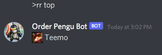

## Overview :crystal_ball:
A League of Legends discord bot that goes beyond simple statistics.
## Features :scroll:

### Feature List :bookmark_tabs:

**lol**: View a player's ranked stats.

**live**: View stats about a player's live game.

**history**: View a players ranked match history.

**recentc**: View the most recently played champions for a player.

**team**: View stats about the players in a champ select lobby.

**draft**: Draft a team (1 champion per role).

**rr**: 'Reroll' a champion.

**m**: View a player's champion masteries.

**info**: View a champion's base stats.

**lore**: View a champion's lore.

**leagueify**: Recieve a mosiac created from league of legends champions and icons.

**And many more to come...**
### Usage :video_game:
**lol** 

**live** 

**history** 

**recentc** 

**team** 

**draft** 

**rr** 

**info** 

**lore** 

**leagueify** 

## Contact
[Ravnit Lotay](https://github.com/Ravnit202)

